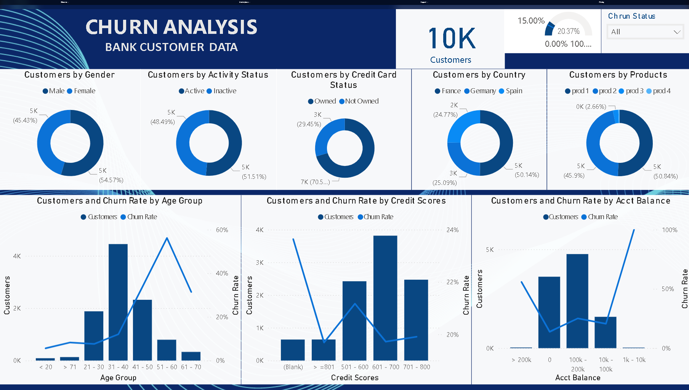

# Bank Customer Churn data analysis

This project analyzes bank customer data to understand churn behavior (customers leaving the bank). It evaluates churn patterns across demographics, account details, credit scores, product usage, and geography to identify key factors influencing customer retention.

## Objective

- To identify patterns and drivers of customer churn.

- To segment customers by demographics, activity, credit, and account details.

- To provide insights for reducing churn and improving customer retention strategies.

## Screenshot

## Key Insights

* Churn Rate: Around 20.37% of customers have churned.

* Demographics: Female customers slightly outnumber males, but churn is not strongly gender-driven.

* Age Factor: Highest churn is among customers aged 41–60, especially 51–60 with churn rate over 50%.

* Credit Scores: Customers with 501–600 credit scores churn more compared to higher credit score groups.

* Account Balance: Very low balance customers (1k–10k) show the highest churn rate (~100%).

* Products: Customers with 2 products have higher churn, while those with 3+ products churn less.

* Geography: Spain has slightly higher churn compared to France and Germany.

* Activity: Inactive customers are more likely to churn compared to active ones.

* Credit Card Ownership: No major churn difference observed between credit card holders and non-holders.

## Conclusion

Customer churn is significantly influenced by age, account balance, and credit scores, rather than gender or credit card ownership. Middle-aged customers with low account balances are the most vulnerable group. Multi-product holding reduces churn probability.

## Recommendations

- Targeted Retention Programs: Focus on customers aged 41–60 with low balances and mid-level credit scores.

- Balance-Linked Incentives: Offer interest benefits or loyalty rewards for maintaining higher balances.

- Credit Improvement Programs: Provide financial literacy and credit score improvement guidance.

- Product Bundling: Encourage customers to use multiple products through discounts or bundled offers.

- Reactivation Campaigns: Engage inactive customers with personalized offers or outreach.

- Geographic Strategies: Deploy churn reduction campaigns more aggressively in Spain.
